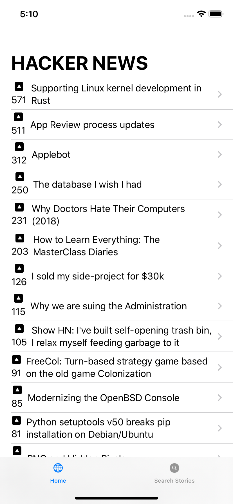
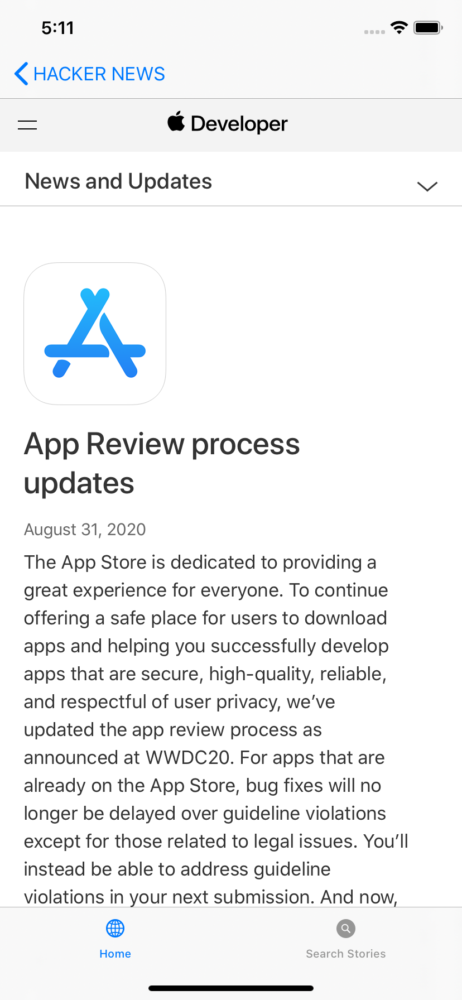

# Hacker-News-iOS-App

**Old Demo**  

<h1> Changes </h1>
<ol>
   <li> Used coordinators to create Search Bar from UIKit rather than using Stacks and TextFields </li>
  <li> Modified WebView and Search View </li>
</ol>

**New Screenshots**  
Home Screen |        WebView      
:-------------------------:|:-------------------------:|
| |

Search View |        Sheet      
:-------------------------:|:-------------------------:|
| |

**ToDo**
- [ ] To save post on long press using Core Data or some other cloud storage
